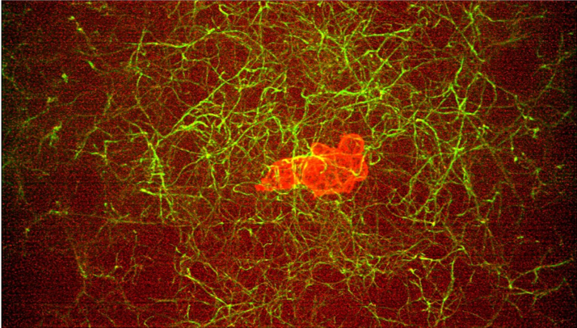
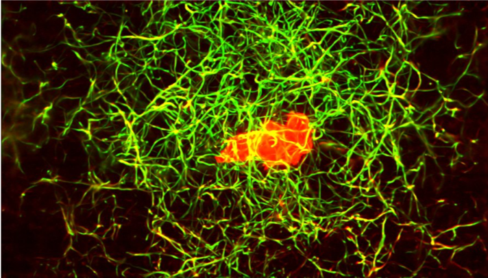

# Denoising microscopy images with deep learning

## Results

### Prediction of cells having the same shape as training data

Microsope: Lattice Light Sheet

<<<<<<< HEAD

=======

>>>>>>> 7b5e21f778ccdb7e9b8ef4133a82decc66d8cd0b

### Prediction of cells having very different shape compared to training data

